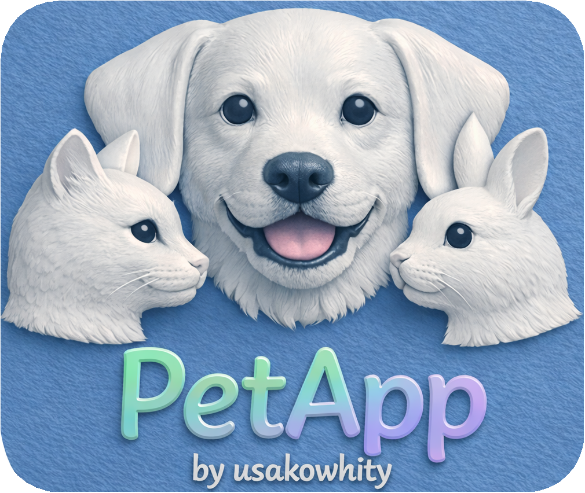

# 🐾 PetApp3  
Next‑generation AI Virtual Pet Application

<p align="center">
  
</p>

**PetApp3** is an AI‑powered virtual pet application that generates realistic images and short videos of your own pets—dogs, cats, and rabbits—based on 15 emotional and behavioral states.

This version introduces a major upgrade:  
**English prompt generation with first‑person perspective**, powered by the new **PromptGenerator_en** module.

PetApp3 is the core project of the PetApp3 series.  
Portable and demo editions are distributed in separate repositories.

---

## 📘 1. Overview

PetApp3 allows you to:

- Register your pet’s **species**, **appearance**, and **affection word**
- Generate optimized English prompts for all 15 states (n1–n3, p1–p12)
- Use external AI tools (Copilot, Gemini, Pika, etc.) to create images or videos
- Display your pet’s reactions in real time through the PlayWindow

PetApp3 focuses on **international usability**, with all prompts and UI elements designed for English-speaking users.

---

## 📘 2. Key Features

### ✔ 15 Pet States (n1–n3, p1–p12)
- **Neutral**: n1 Normal, n2 Sit, n3 Sleep  
- **Positive**: p1–p11 (Play, Down, Paw, Meal, Water, Toilet, Fetch, House, Stand, Bath)  
- **Special**: **p12 Affection**  
  - Reacts to your custom **affection word**  
  - Generates a short affectionate video

### ✔ English Prompt Generator (PromptGenerator_en)
- Generates natural English prompts for all states  
- Uses **first‑person perspective (my / me)**  
- p2 Joy is **species‑specific** (dog / cat / rabbit)  
- p12 Affection produces a **video prompt** with scene, mood, and camera details

### ✔ AI Image/Video Generation Support
Prompts can be copied into external AI tools:
- Copilot Image / Video  
- Gemini  
- Pika  
- Runway (optional)

### ✔ Modular Architecture
- Clear separation of UI, core logic, prompt generation, and data handling  
- Easy to extend for future species or states

---

## 📘 3. How It Works

1. Register your pet’s profile:
   - Species  
   - Appearance  
   - Custom **affection word** (p12)  
2. Select a state (n1–n3, p1–p12).  
3. PetApp3 generates an English prompt tailored to your pet.  
4. Copy the prompt into your preferred AI tool to generate an image or video.  
5. Assign the generated media to each state.  
6. The PlayWindow displays your pet reacting in real time.

---

## 📘 4. Folder Structure

```
PetApp3/
 ├ assets/
 ├ core/
 ├ data/
 ├ ffmpeg/
 ├ generated/
 ├ play/
 ├ ui/
 ├ utils/
 ├ voice/
 ├ controller.py
 ├ main.py
 ├ README.md
 ├ LICENSE
 └ CREDITS.md
```

---

## 📘 5. Related Repositories  
*(These repositories will be published soon.)*

### 🔹 Portable Edition  
Standalone version with embedded Python  
https://github.com/usakowhity/PetApp3-portable

### 🔹 Demo Edition (Taro Edition)  
https://github.com/usakowhity/PetApp3_taro

---

## 📘 6. GitHub Pages (Official Website)  
*(Coming soon)*

https://usakowhity.github.io/PetApp3/

---

## 🐰 Support for Rabbit Rescue

The PetApp series supports the activities of the  
**Rabbit & Human Happiness Support Association**.

Learn more:  
https://usagi-support.org/

Donation / Support:  
https://usagi-support.org/?p=453

---

## 📄 License

MIT License  
Copyright (c) 2026 usakowhity
```


